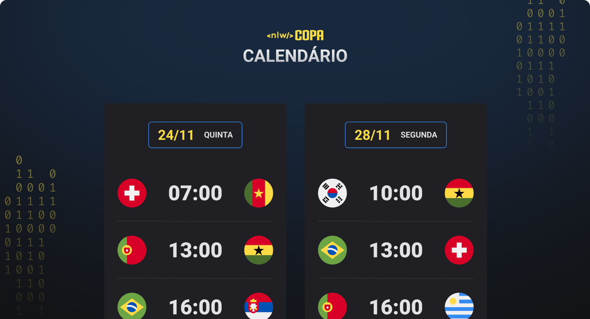

<h1 align="center"> NLW Calendario Copa</h1>

Calendario Copa do Mundo  
Este calendario foi criado com apenas HTML e CSS

  <a href="#-tecnologias">Tecnologias</a>&nbsp;&nbsp;&nbsp;|&nbsp;&nbsp;&nbsp;
  <a href="#-projeto">Projeto</a>&nbsp;&nbsp;&nbsp;

 

  

 

## 🚀 Tecnologias
---

Esse projeto foi desenvolvido com as seguintes tecnologias:

- HTML e CSS
- Git e Github

---
## 💻 Projeto

 0 Calendário da Copa é um projeto que mostra os Jogos da Copa de 2022
 
---

 [Acesse o Projeto](https://allesoares95.github.io/NLW-Desktop---Calendario-HTML/)

